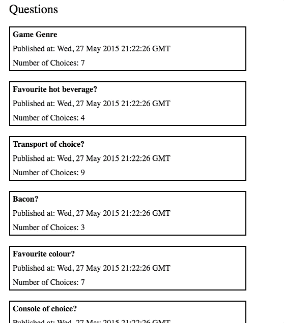

# BCGDV Berlin Frontend Coding Challenge - Christine Javier

## Summary

Polls is a single page application that lets users vote through the Polls
API.
At this time, Polls can only be used via local hosting (see instruction below for how to see this).

Documentation for the API is available at http://docs.pollsapi.apiary.io/.
Refer to the documentation for details on how to query the API.

## Step-by-step guide to viewing this application locally
1. Clone in repository via running `git clone git@github.com:christinejavier/polls.git`
2. cd into `polls` directory
3. Install dependencies by running `npm install`
4. Run `npm start` to run app in development mode.
5. Open [http://localhost:3000](http://localhost:3000) to view it in the browser.

## Features

- [List of questions page](http://pasteboard.co/8AReDrPvo.jpg)
- [Question detail page](http://pasteboard.co/8ARC7212L.jpg)

## Notes

- This project was created using create-react-app
  [create-react-app](https://github.com/facebookincubator/create-react-app).
- Commit all changes to a Git repository and follow
  [good commit message practice](https://chris.beams.io/posts/git-commit/).

## Available Scripts

In the project directory, you can run:

### `npm start`

Runs the app in the development mode. 
Open [http://localhost:3000](http://localhost:3000) to view it in the browser.

The page will reload if you make edits. 
You will also see any lint errors in the console.

### `npm run build`

Builds the app for production to the `build` folder. 
It correctly bundles React in production mode and optimizes the build for the best performance.

The build is minified and the filenames include the hashes. 
Your app is ready to be deployed!

See the section about [deployment](https://facebook.github.io/create-react-app/docs/deployment) for more information.

### `npm run build` fails to minify

This section has moved here: https://facebook.github.io/create-react-app/docs/troubleshooting#npm-run-build-fails-to-minify
